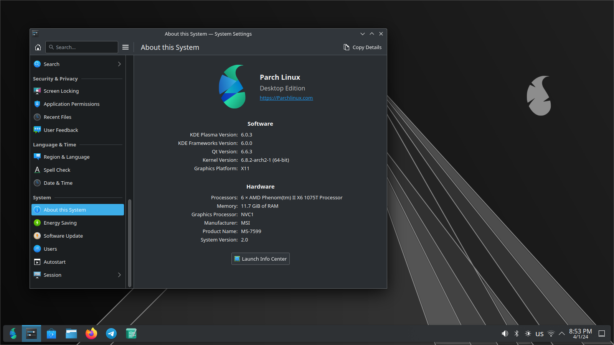

# Parch Linux Plasma edition

## EN

### What is Plasma Desktop?

KDE Plasma is a feature-rich and highly customizable desktop environment that offers a modern and intuitive user experience. It is known for its flexibility, extensive customization options, and a wide range of applications and tools.

### Pre-Installed Applications

| Name         | Usage     | Category |
|--------------|-----------|------------|
| Tokodon         | A client to Browse the fediverse.      | Social        |
| Neochat      | A client to Browse the [Matrix].  | Social       |
| PlasmaTube | A client to watch peertube and piped youtube | Movie & Music |
| VLC | A Video Player written in QT | Movie & Music |
| Elisa | A Simple and easy to use Music Player written in cpp and Kirigami | Movie & Music | 
| Firefox | Fast, Private & Safe Web Browser | Web Browser |
| MarkNote | Take notes in Markdown | Productivity |

‌
# Fa

## میزکار پلاسما چیست؟

کی‌دی‌ای پلاسما یک محیط دسکتاپ با ویژگی های غنی و بسیار قابل تنظیم است که تجربه کاربری مدرن و بصری را ارائه می دهد. این به دلیل انعطاف پذیری، گزینه های سفارشی سازی گسترده و طیف گسترده ای از برنامه ها و ابزارها شناخته شده است.

### برنامه های از پیش نصب شده

| نام | استفاده | دسته بندی |
|--------------|----------|------------|
| Tokodon | کلاینتی برای مرور فدیورس. | اجتماعی |
| neochat | کلاینتی برای مرور [ماتریس]. | اجتماعی |
| plasmatube | کلاینتی برای تماشای peertube و piped youtube | فیلم و موسیقی |
| VLC | یک پخش کننده ویدیو نوشته شده در cpp و qt| فیلم و موسیقی |
| Elisa | یک پخش کننده موسیقی ساده و آسان برای استفاده که در CPP و Kirigami نوشته شده است. | فیلم و موسیقی |
| FireFox | مرورگر وب سریع، خصوصی و ایمن | مرورگر وب |
| MarkNote | یادداشت برداری در Markdown | بهره وری |

